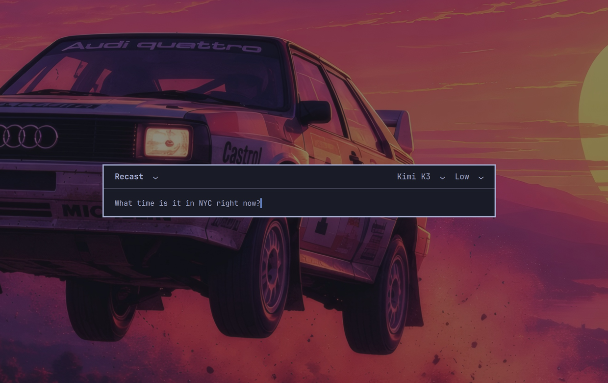
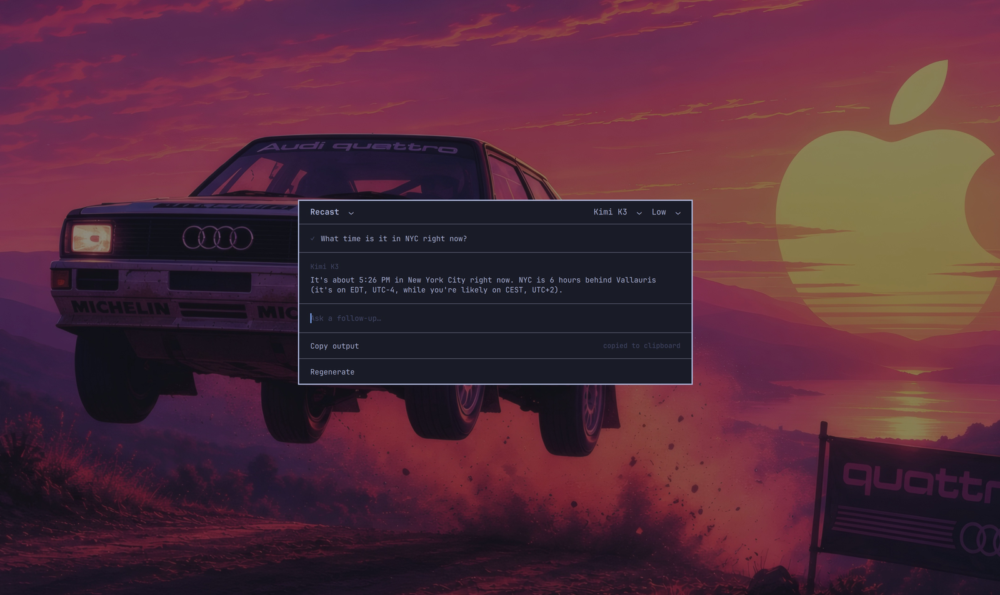
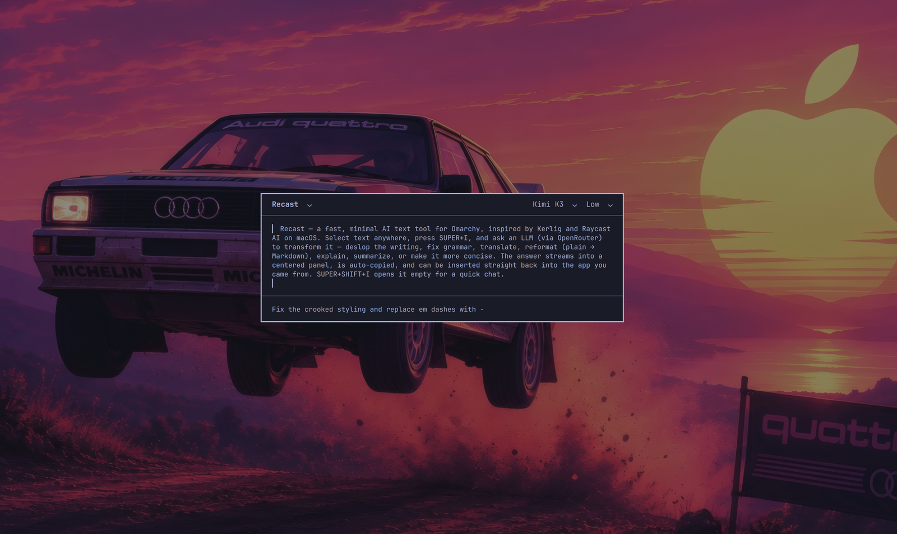
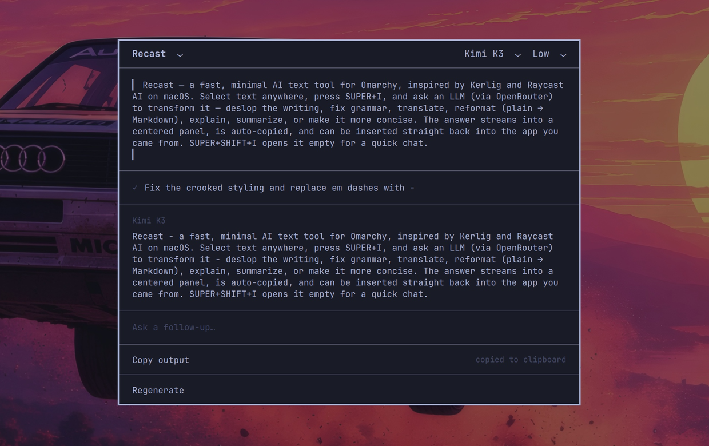

# Recast

A fast, minimal AI text tool for [Omarchy](https://omarchy.org) - a native shell plugin.
Inspired by [Kerlig](https://www.kerlig.com/) and Raycast AI on macOS: the simplest, most
productive way to ask an LLM something quickly, or get corrections on a piece of text - without
leaving the app you're in.

Select text anywhere and press **SUPER+I** to transform it with an LLM (via
[OpenRouter](https://openrouter.ai)); the answer streams into a centered panel and is copied
to your clipboard. Follow up to refine, regenerate, or insert the result back into the app you
came from. Or press **SUPER+SHIFT+I** to open it empty and just chat.

## Screenshots

**Quick chat** - press `SUPER+SHIFT+I`, ask anything; the model gets live context (the date, your location, the active app):




**Transform selected text** - select text in any app, press `SUPER+I`, and give an instruction:




## What it's for

Highlight text, hit `SUPER+I`, and ask - for example:

- **Deslop the writing** - strip the AI-ese and filler
- **Correct the grammar**
- **Translate**
- **Change the format** - e.g. plain text → Markdown
- **Explain** complex words or topics
- **Summarize**
- **Make it more concise**

The result is streamed in and copied to your clipboard, ready to paste - or **Insert** it straight
back into the app you came from.

## Install

```bash
omarchy plugin add https://github.com/TNEP4/recast.git --enable
```

Then add the keybindings - append [`bindings.snippet.lua`](bindings.snippet.lua) to
`~/.config/hypr/bindings.lua` and `hyprctl reload`:

```lua
local recast = os.getenv("HOME") .. "/.config/omarchy/plugins/io.github.tnep4.recast/bin/recast-launch"
o.bind("SUPER + I", "Recast selection", { launch = recast })
o.bind("SUPER + SHIFT + I", "Recast chat", { launch = recast .. " --chat" })
```

Set your OpenRouter API key: open Recast, press **Ctrl+,**, paste the key, Enter. It is stored
in the system keyring (never on disk). You can also export `OPENROUTER_API_KEY` instead.

Dependencies (all in Omarchy's base): `curl`, `jq`, `wl-clipboard`, `libsecret` (`secret-tool`),
plus `hyprctl` and the `omarchy-shell`. Location context uses `omarchy-weather-location` if present.

## Removing it

1. Delete the Recast keybinding lines you appended to `~/.config/hypr/bindings.lua`, then `hyprctl reload`.
2. `omarchy plugin remove io.github.tnep4.recast`
3. Optional cleanup: `rm -rf ~/.config/recast` (settings) and
   `secret-tool clear service openrouter app recast` (the stored API key).

## Using it

- **SUPER+I** - transform the current selection. Type an instruction, `Enter` to send. A spinner
  shows until the first token, then the answer streams in and is auto-copied.
- **SUPER+SHIFT+I** - open empty for a direct chat (no selection).
- After an answer: **Copy output**, **Regenerate**, **Insert in <app>** (pastes into the window
  the selection came from). Type a follow-up to keep refining - the conversation is kept.
- The top bar has a **model** picker and a **reasoning-effort** picker.

### Dynamic context

The model is given live context so it can be more useful. Chat mode includes it automatically, and
you can drop these placeholders into your own system prompt (Settings → *System prompt*) - they're
filled in each time you send:

| Placeholder | Becomes |
|---|---|
| `{current-date-time}` | the current local date and time |
| `{location}` | your location (from Omarchy's weather setting, `omarchy-weather-location`) |
| `{currently-opened-app}` | the app you invoked Recast from |

### Keyboard

| Keys | Action |
|---|---|
| `Enter` | Send |
| `Ctrl+M` / `Ctrl+E` | Open the model / effort picker (↑/↓ to move, `Enter` to pick) |
| `Ctrl+,` | Settings (API key) |
| `Esc` | Close (a picker/settings first, then the panel) |

## Models & effort

Fifteen frontier models ship built in (Claude, GPT, Gemini, Grok, DeepSeek, Qwen, Kimi, Mistral,
Meta). To use anything else, open **Settings** (`Ctrl+,`) → **Custom models**, paste an
[OpenRouter model path](https://openrouter.ai/models) (`org/slug`, e.g. `openai/gpt-4o`) and press
Enter. It joins the top-bar model picker immediately and is selected for you - so you can add the
newest OpenRouter models yourself without waiting for an app update. Remove one with the `✕` beside
it. Custom models are saved to `~/.config/recast/config.json`.

The effort picker maps to OpenRouter's `reasoning.effort` and is sent only when it isn't *Default*
and the model supports reasoning; it's hidden for models that don't. Model and effort persist to
`~/.config/recast/config.json`.

## How it works

Recast is a summoned Omarchy `panel` plugin (a layer-shell surface hosted by `omarchy-shell`).
The keybind runs `bin/recast-launch`, which grabs the primary selection and active window and
summons the panel over shell IPC with a JSON payload. Streaming is `curl -N` against
OpenRouter's SSE endpoint; the key is read via `secret-tool`. See
[`docs/PLUGIN-RESEARCH.md`](docs/PLUGIN-RESEARCH.md) and [`docs/DEV.md`](docs/DEV.md).

The original standalone GTK4/Python version is preserved in [`legacy/`](legacy/).

## Coming next

- **Custom actions** - create your own (or let the AI write them for you): the prompts you reach
  for most, saved and just a few keystrokes away. Put your best prompts on a shelf.

## License

MIT - see [LICENSE](LICENSE).
